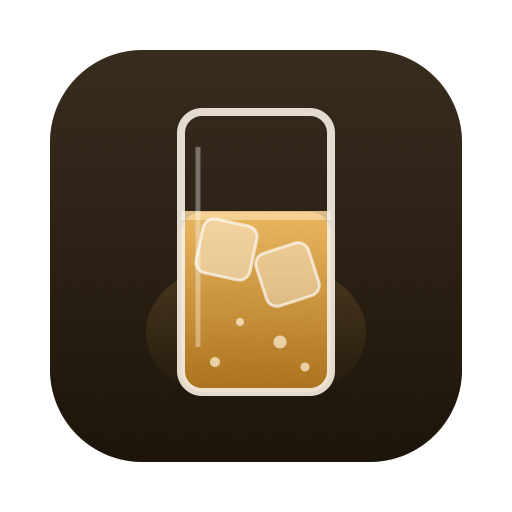

<h1 align="center">highball-db</h1>

The open compatibility database behind [Highball](https://github.com/gauthierpiarrette/highball):
Windows games and launchers on Apple Silicon through Wine + DXMT / D3DMetal / DXVK,
**as data with provenance** — verified runs, upstream reports, community consensus, and the
kernel-anti-cheat blocklist.

- `recipes/` — declarative install/config recipes (launchers, games, tweaks) applied by Highball
- `db/games/` — one JSON per title: `status` ∈ `verified-local · reported-upstream · community · blocked-anticheat`, plus `provenance`
- `db/reports/` — append-only community reports, folded in from issues labeled `report-accepted`
- `db/derived/` — **prediction layer** (ODbL): recent ProtonDB verdicts × anti-cheat knowledge → a macOS likelihood for ~12,500 more games. Predictions, never verifications.
- `db/anticheat.json` — Mac-aware anti-cheat map for 1,166 titles, imported from [Are We Anti-Cheat Yet?](https://areweanticheatyet.com) (MIT)
- `Scripts/` — validator, report ingester, importers (AWACY, ProtonDB dumps), static-site generator (GitHub Pages)

**Contribute:** run something through Highball, then `highball report` — it opens a pre-filled
issue here. Or PR a recipe with the CLI output attached. Almost everything here is CC0: use it in your
own launcher, wiki, or even with CrossOver.

**Licensing, precisely:** curated game data, recipes and reports are **CC0-1.0**.
`db/derived/` (the ProtonDB-derived predictions) is **ODbL-1.0** and must keep its attribution —
see `db/derived/LICENSE`. `db/anticheat.json` derives from AreWeAntiCheatYet and keeps its **MIT**
notice in `db/anticheat.LICENSE`.
